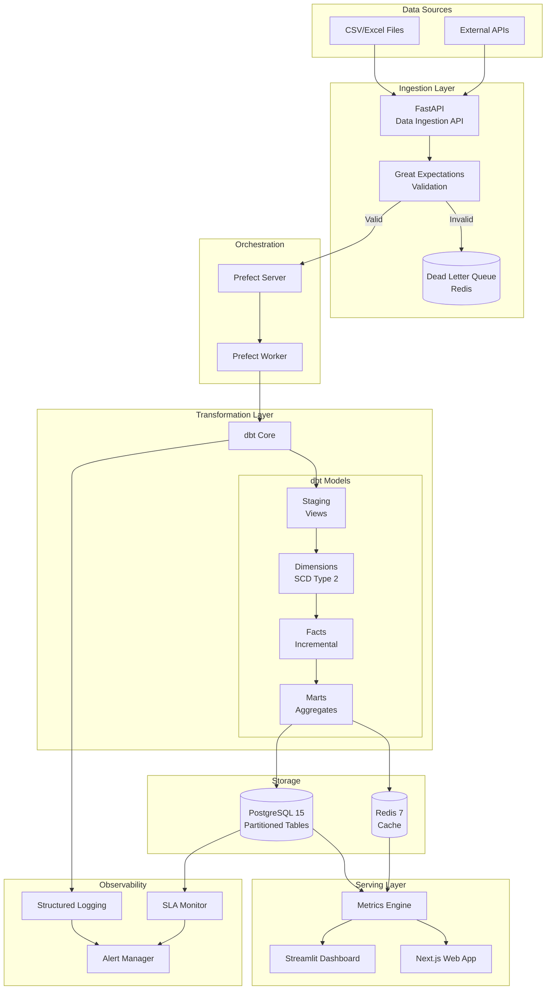
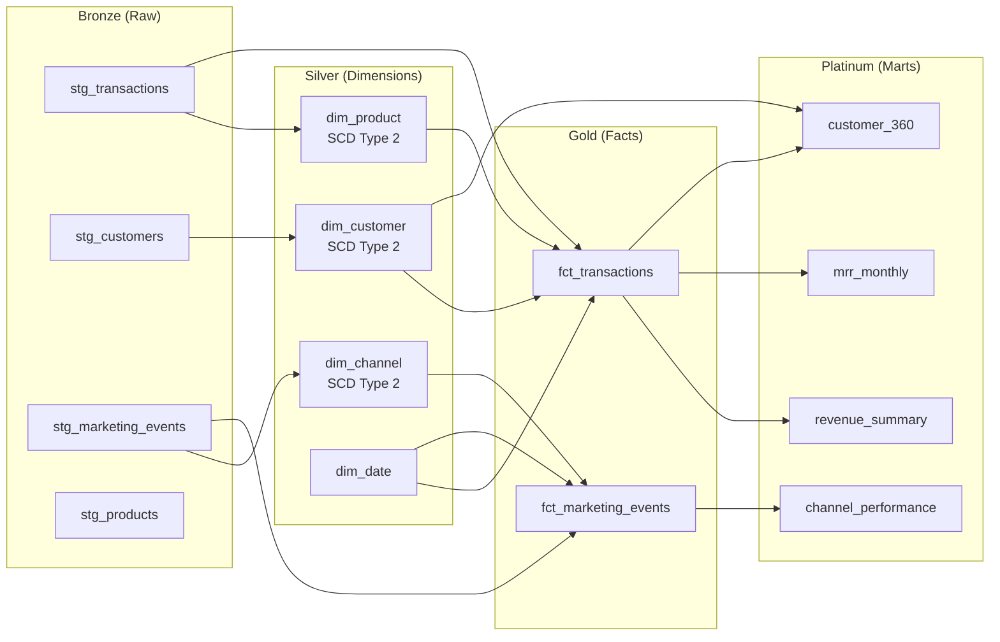

# Echo Analytics Platform

An analytics platform I built to turn messy business data into something useful. Upload a CSV, get metrics, see trends, ask questions in plain English.


**[Live Dashboard Demo](https://echo-analytics.streamlit.app)**

---

## The Problem

Small businesses have data everywhere - spreadsheets, exports, random CSVs. They need answers but don't have time to wrestle with formulas or learn BI tools. I wanted to build something that handles the messy parts automatically.

## What I Built

**Data Pipeline**: Ingest raw files, detect schemas, clean the mess (currency symbols, date formats, inconsistent booleans), validate quality, then calculate metrics.

**Analytics Layer**: 20+ business metrics computed deterministically. Revenue trends, cohort retention, customer segmentation, funnel analysis. All tested, all reproducible.

**Two Interfaces**:

- **Streamlit Dashboard** - KPIs, charts, drill-downs for BI-style analysis
- **Next.js Web App** - Chat interface where you ask questions in plain English, powered by an LLM that explains the numbers (but never calculates them - that's handled by tested Python code)

---

## Architecture



## Data Flow (Medallion Architecture)



---

## Performance at Scale

### Synthetic Data Generation

Generate realistic datasets at scale for benchmarking:

```bash
# Generate 1M, 10M, or 50M row datasets
python -m generators.cli generate --scale 1M --output-dir ./data/generated/1M
python -m generators.cli generate --scale 10M --output-dir ./data/generated/10M
python -m generators.cli generate --scale 50M --output-dir ./data/generated/50M --format parquet
```

The generator creates customers, products, transactions, marketing events, and experiments with:

- Proper foreign key relationships
- Realistic distributions (Pareto for revenue, normal for daily patterns)
- SCD-triggering changes (customer segment upgrades, price changes)

### Query Performance Benchmarks

| Query            | 1M Rows | 10M Rows | 50M Rows | 50M (Partitioned) | Improvement    |
| ---------------- | ------- | -------- | -------- | ----------------- | -------------- |
| Monthly Revenue  | 120ms   | 890ms    | 4.2s     | 520ms             | **8x faster**  |
| Last 30 Days     | 85ms    | 340ms    | 1.8s     | 45ms              | **40x faster** |
| Customer LTV     | 340ms   | 2.8s     | 14s      | 1.1s              | **13x faster** |
| Cohort Retention | 890ms   | 3.2s     | 18s      | 4.5s              | **4x faster**  |

_Benchmarks run on PostgreSQL 15, Apple M1, with date-range partitioned tables_

### PostgreSQL Partitioning

Transactions table is range-partitioned by month:

```sql
CREATE TABLE transactions_partitioned (
    transaction_id TEXT,
    transaction_date DATE NOT NULL,
    amount DECIMAL(12, 2),
    ...
) PARTITION BY RANGE (transaction_date);

-- Automatic partition pruning for date-range queries
```

---

## Technical Highlights

### Data Modeling

**Star Schema with SCD Type 2** - Proper dimensional modeling with:

- `dim_customer` - Tracks segment and plan changes over time
- `dim_product` - Tracks price changes for historical revenue accuracy
- `dim_channel` - Tracks marketing channel reclassifications
- `dim_date` - Full calendar dimension with fiscal year support
- `fct_transactions` - Transaction facts with point-in-time dimension joins
- `fct_marketing_events` - Marketing funnel facts

```sql
-- Point-in-time dimension join preserves historical accuracy
SELECT
    t.transaction_date,
    c.segment AS customer_segment_at_purchase,
    p.price AS product_price_at_purchase,
    t.amount
FROM fct_transactions t
LEFT JOIN dim_customer c
    ON t.customer_sk = c.customer_sk
LEFT JOIN dim_product p
    ON t.product_sk = p.product_sk
```

### Data Engineering

**ETL with Prefect** - Orchestrated flows for daily metric computation, incremental loads, and error handling.

**dbt Models** - Transformations organized into staging, dimensions, facts, and marts. Incremental loads, SCD Type 2 history tracking, data contracts.

**Data Quality with Great Expectations** - 26 validation rules catching nulls, duplicates, referential integrity issues, and schema drift before bad data hits the warehouse.

**Data Cleaning** - The `DataAutoFixer` service normalizes column names, parses mixed date formats, strips currency symbols, standardizes booleans, and flags outliers.

### Observability

**Structured Alerting** - Log-based alerts for SLA breaches, data quality failures, pipeline errors:

```python
from observability.alerts import AlertManager, AlertType, AlertSeverity

alert_manager = AlertManager()
alert_manager.emit_sla_breach(
    pipeline_name="daily_metrics",
    sla_type="runtime",
    threshold="60 minutes",
    actual="85 minutes"
)
```

**Dead Letter Queue** - Redis-backed queue for failed records with retry tracking:

```python
from observability.dead_letter_queue import DeadLetterQueue, FailedRecord

dlq = DeadLetterQueue(redis_client)
dlq.push(FailedRecord(
    record_id="txn_123",
    source_table="transactions",
    raw_data={"amount": "invalid"},
    error_message="Could not parse amount"
))
```

**SLA Monitoring** - Automated freshness checks and runtime monitoring:

```python
from observability.sla_monitor import SLAMonitor

monitor = SLAMonitor(db_connection, alert_manager)
freshness = monitor.check_freshness("fct_transactions", max_age_hours=6)
```

### CI/CD Pipeline

GitHub Actions workflow with:

- Python linting (Ruff, Black, isort)
- SQL linting (SQLFluff)
- Test suite with coverage reporting
- dbt model validation
- Docker image builds
- Security scanning (Bandit, Safety)

---

## SQL Portfolio

**10+ queries in `sql/analytics/`** covering:

- CTEs and window functions (LAG, LEAD, NTILE, ROW_NUMBER)
- Cohort retention matrices
- RFM customer segmentation
- Funnel conversion analysis
- Time series with moving averages and anomaly detection

```sql
-- Month-over-month revenue growth
WITH monthly AS (
    SELECT DATE_TRUNC('month', transaction_date) AS month,
           SUM(amount) AS revenue
    FROM transactions
    GROUP BY 1
)
SELECT month, revenue,
       LAG(revenue) OVER (ORDER BY month) AS prev_month,
       ROUND((revenue - LAG(revenue) OVER (ORDER BY month)) /
             NULLIF(LAG(revenue) OVER (ORDER BY month), 0) * 100, 2) AS growth_pct
FROM monthly;
```

---

## Why I Made These Choices

### Why dbt for Transformations?

I evaluated dbt, Spark, and raw SQL. dbt won because:

1. **Testability** - Built-in testing framework catches data issues before they reach marts
2. **Lineage** - Auto-generated DAG shows data dependencies
3. **Incremental** - Native support for incremental models reduces compute cost
4. **Docs-as-code** - Documentation is generated from the same code that runs transformations

### Why SCD Type 2 for Dimensions?

Customer segments and product prices change. Without history:

- "What was our revenue from Enterprise customers in Q1?" becomes unanswerable
- Cohort analysis breaks when customers upgrade plans
- A/B test attribution becomes unreliable when customers switch variants

SCD Type 2 preserves the truth at any point in time.

### Why PostgreSQL Partitioning?

At 50M rows, query performance degrades significantly. Partitioning by month enables:

- **Partition pruning** - Queries only scan relevant partitions (8-40x faster)
- **Efficient archival** - `DROP PARTITION` vs `DELETE` for old data
- **Better maintenance** - VACUUM runs per-partition, faster index rebuilds

### Why Prefect over Airflow?

1. **Local-first** - Works without a cluster for development
2. **Native Python** - Flows are just decorated functions, not DAG definitions
3. **Better error handling** - First-class support for retries and failure states
4. **Modern UI** - Cleaner interface for monitoring

### Why Great Expectations?

Data validation happens BEFORE transformations, not after:

- Expectation suites live alongside code
- Data docs for stakeholder visibility
- Integration with Prefect for blocking on failures

---

## Screenshots

### Streamlit Dashboard

|                       Overview                        |                  Revenue Analysis                  |                 Customer Segmentation                  |
| :---------------------------------------------------: | :------------------------------------------------: | :----------------------------------------------------: |
|  |  |  |

### Next.js Web App

|                   Metrics View                   |                 Chat Interface                  |                     Reports                      |
| :----------------------------------------------: | :---------------------------------------------: | :----------------------------------------------: |
|  |  |  |

---

## Project Structure

```
echo-analytics-platform/
├── app/                      # FastAPI backend
│   ├── api/v1/               # REST endpoints
│   ├── services/             # Business logic
│   │   ├── metrics/          # Metric calculations
│   │   ├── experiments/      # A/B testing
│   │   └── llm/              # LLM integration
│   └── models/               # SQLAlchemy models
├── frontend/                 # Next.js web app
├── dashboard/                # Streamlit BI dashboard
├── dbt/                      # dbt transformations
│   └── models/
│       ├── staging/          # Raw data cleaning
│       ├── dimensions/       # SCD Type 2 dimensions
│       ├── facts/            # Incremental fact tables
│       └── marts/            # Business aggregates
├── generators/               # Synthetic data generation
├── benchmarks/               # Query performance testing
├── migrations/partitioning/  # PostgreSQL partitioning
├── observability/            # Alerts, DLQ, SLA monitoring
├── orchestration/            # Prefect ETL flows
├── data_quality/             # Great Expectations
├── sql/                      # SQL query portfolio
├── notebooks/                # Analysis notebooks
└── tests/                    # Test suite (238 tests)
```

| Layer           | Technology                           |
| --------------- | ------------------------------------ |
| API             | FastAPI 0.104, Python 3.11           |
| Database        | PostgreSQL 15 (partitioned), Redis 7 |
| Web App         | Next.js 15, TypeScript, Tailwind CSS |
| Dashboard       | Streamlit 1.29, Plotly               |
| ETL             | Prefect 2.14                         |
| Transformations | dbt 1.7                              |
| Data Quality    | Great Expectations 0.18              |
| CI/CD           | GitHub Actions                       |

---

## Running It

### Dashboard (Streamlit)

Live at **[echo-analytics.streamlit.app](https://echo-analytics.streamlit.app)**

Or run locally:

```bash
pip install streamlit plotly pandas
streamlit run dashboard/app.py
```

### Full Stack (Docker)

```bash
git clone https://github.com/Hussain0327/echo-analytics-platform.git
cd echo-analytics-platform
cp .env.example .env
# Add your DEEPSEEK_API_KEY or OPENAI_API_KEY

docker-compose up -d

# Frontend
cd frontend && npm install && npm run dev

# Open http://localhost:3000
```

### Generate Synthetic Data

```bash
python -m generators.cli generate --scale 1M --output-dir ./data/generated/1M
python -m generators.cli validate --data-dir ./data/generated/1M
```

### Run Benchmarks

```bash
python -m benchmarks.run_all --table transactions --output benchmarks/results.md
```

### Notebooks

```bash
jupyter notebook notebooks/
```

---

## What I Learned

**Data cleaning is most of the work.** The `DataAutoFixer` went through five rewrites. Real data is messy in ways you don't expect until you see it.

**LLMs are bad at math.** I learned this the hard way. Now Python handles all calculations, and the LLM just explains results it's given. Much more reliable.

**Testing saves time.** 238 tests sounds like a lot, but they caught regressions constantly. Especially when refactoring the metrics engine.

**Partitioning is worth the complexity.** The 8-40x query speedup at scale justifies the additional partition management overhead.

**SCD Type 2 is easier than you think.** Once you have the pattern down, applying it to new dimensions is straightforward.

---

## License

MIT
